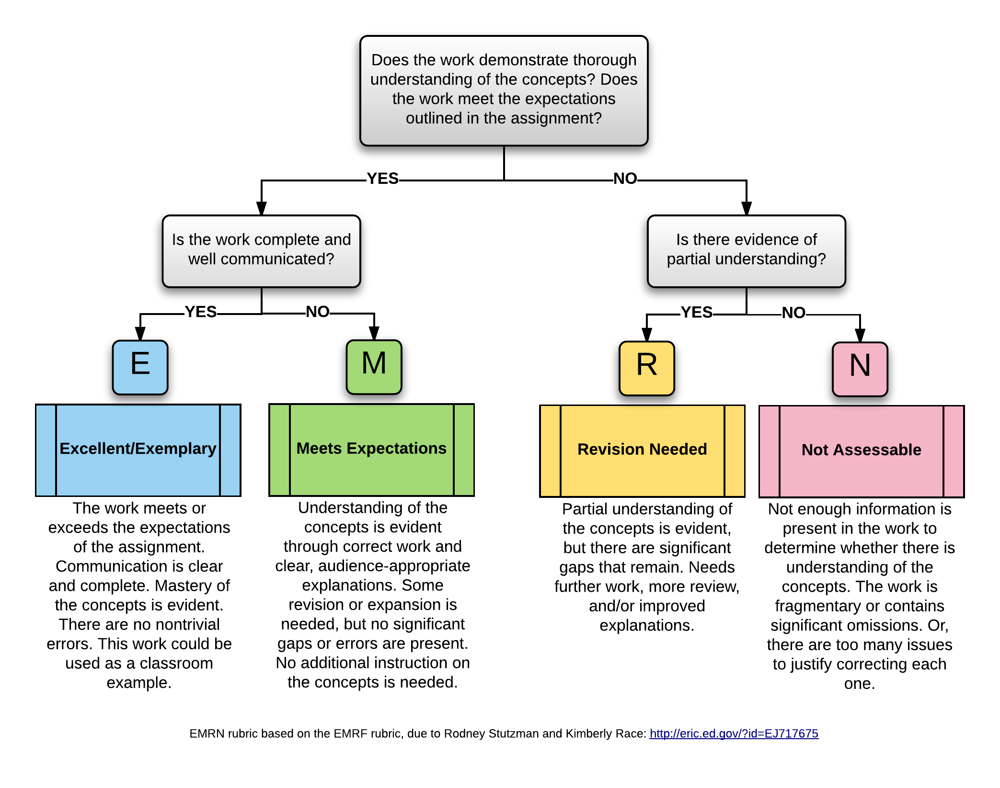

# Assessment and grading system in MTH 201

**Disclaimer:** This is not syllabus language. It is just a detailed spec of my assessment and grading scheme in draft form, for colleagues to review and critique. A more student-readable version will come later. 

## Structure of the course 

MTH 201 (Calculus) is a 4-credit course. It is being taught in a "staggered hybrid" format: 

+ The roster is split into two groups ("Red Team" and "Blue Team") 
+ Red Team meets face-to-face (F2F) on Mondays/Wednesdays for 50 minutes each; Blue Team meets F2F on Tuesdays/Thursdays for 50 minutes each 
+ The remaining work for the course (equivalent of 100 minutes per week for each team) is done through asynchronous online work

The course is divided into 12 **modules**, each of which is further divided into Part A and Part B. Part A of each module is the focus of the first half of the week, Part B the second half. 

**Example:** Module 4 is focused on *How do we efficiently compute derivatives of basic functions?* (intro to derivative shortcuts), specifically Sections 2.1 and 2.2 of Matt Boelkins' [Active Calculus](https://activecalculus.org/single/frontmatter.html) book. Module 4A will focus on derivatives of power, polynomial, and exponential functions as well as sum/differences (essentially 2.1 in Active Calculus) while Module 4B is a review of 4A plus the derivatives of the sine and cosine functions. Red Team will get in-class work on Module 4A in their Monday meeting; Blue Team will get the exact same work in their Tuesday meeting. Likewise Red Team will get in-class work on Module 4B in their Wednesday meeting; Blue Team will get the exact same work in their Thursday meeting. 

The in-class work on a module part will only go roughly halfway through the complete lesson on that part. The rest of the lesson will be done through asynchronous online work. For example, in Module 4A, Red Team will do initial in-class work on Monday but then further active work on Module 4A on Tuesday, and complete it by Tuesday night. Similarly Blue Team will do initial in-class work on Tuesday but then further active work on Module 4A on Wednesday, and complete it by Wednedsday night. 

## Learning Objectives 

## Course-Level Learning Objectives

- Use functions and other pre-Calculus mathematics proficiently.
- Calculate, use, and explain the concept of limits.
- Explain and interpret the meaning of the derivative of a function.
- Use shortcuts to calculate derivatives efficiently.
- Use derivatives to solve authentic real-life application problems.
- Use definite integrals and the Fundamental Theorem of Calculus to find areas and total change.

## Modules and Module-Level Learning Objectives

- Group F: Use functions and other pre-Calculus mathematics proficiently.
  - F.1: I can find the average rate of change of a function on an interval.
- Group L: Calculate, use, and explain the concept of limits.
  - L.1: **(CORE)** I can find the limit of a function at a point using numerical, graphical, and algebraic methods.
  - L.2: I can identify limits in indeterminate form and apply L'Hopital's Rule to evaluate them. 
- Group D: Explain and interpret the meaning of the derivative of a function.
  - D.1 **(CORE)**: I can find the derivative of a function, both at a point and as a function, using the definition of the derivative. 
  - D.2 **(CORE)**: I can use derivative notation correctly, state the units of a derivative, estimate the value of a derivative using difference quotients, and correctly interpret the meaning of a derivative in context. 
  - D.3 **(CORE)**: Given information about $f$, $f'$, or $f''$, I can correctly give information about $f$, $f'$, or $f''$ and the increasing/decreasing behavior and concavity of $f$ (and vice versa).
  - D.4: I can determine where a function is continuous or differentiable given a graph or formula of the function and explain my reasoning.
  - D.5: I can find the equation of the tangent line to a function at a point and use the tangent line to estimate values of the function.  **May be assessed through AEP** 
- Group DC: Use shortcuts to calculate derivatives efficiently.
  - DC.1 **(CORE)**: I can compute derivatives correctly for power, polynomial, and exponential functions and the sine and cosine functions, and basic combinations of these (constant multiples, sums, differences). 
  - DC.2 **(CORE)**: I can compute derivatives correctly for products, quotients, and composites of functions. **Not complete until 2.5** 
  - DC.3: I can compute derivatives correctly using multiple rules in combination. 
  - DC.4: I can compute the derivatives correctly for logarithmic, trigonometric, and inverse trigonometric functions. 
- Group DA: Use derivatives to solve authentic real-life application problems.
  - DA.1 **(CORE)**: I can find the critical values of a function, determine where the function is increasing and decreasing, and apply the First and Second Derivative Tests to classify the critical points as local extrema.
  - DA.2: I can determine the intervals of concavity of a function and find all of its points of inflection.
  - DA.3: I can use the Extreme Value Theorem to find the absolute maximum and minimum values of a continuous function on a closed interval.
  - DA.4 **(CORE)**: I can set up and use derivatives to solve applied optimization problems.
  - DA.5: I can compute the derivative of an implicitly-defined function and find the slope of the tangent line to an implicit curve. 
  - DA.6: I can set up and use derivatives to solve related rates problems.
- Group INT: Use definite integrals and the Fundamental Theorem of Calculus to find areas and total change.
  - INT.1: I can calculate the area between curves, net change, and displacement using geometric formulas and Riemann sums.
  - INT.2: I can explain the meaning of each part of the definition of the definite integral in terms of a graph, and interpret the definite integral in terms of areas, net change, and displacement.
  - INT.3: I can evaluate a definite integral using geometric formulas and the Properties of the Definite Integral. 
  - INT.4 **(CORE)**: I can evaluate a definite integral using the Fundamental Theorem of Calculus.
  - INT.5 **(CORE)**: I can correctly antidifferentiate basic functions and identify antiderivatives. 
  - INT.6 I can find the average value of a function and the net change in a function over an interval using a definite integral.

**Note**: There are 24 Learning Targets in all, 10 of which are designated as **Core** Learning Targets that represent the essential concepts of the course. 

## Types of graded activities 

+ **Checkpoints**: These are bi-weekly assessments that provide opportunities to demonstrate mastery of past and recent Learning Targets. Each Checkpoint will contain one (usually multi-part) problem per Learning Target that has been covered in the class up to that point. Students will be provided with a detailed rubric for what constitutes acceptable work on each Checkpoint problem. Work that meets the criteria for acceptable work will be given a "check"; work that does not meet the criteria will receive an "X". **Work receiving an "X" can be redone at any later Checkpoint**. See the Revision policy for details. 
+ **Application/Extension Problems (AEPs)**: AEPs are more extensive problems that require applying or extending the basic course knowledge from the Learning Targets. Most require technology, and all will require a formal writeup. There will be at least 10 AEP sets posted during the semester. 
+ **WeBWorK**: Twice a week, students will complete 8-item WeBWorK sets that provide opportunities to practice the basics and to review. These will be due Wednesday and Sunday nights at 11:59pm ET. WeBWork allows for unlimited multiple attempts without penalty up to those deadlines. Each WeBWorK item is worth 1 point (some allow partial credit), and there will be at least 192 points' worth (16 items per module times 12 modules) during the semester. 
+ **Daily Prep**: To ensure that we use time appropriately when we meet face-to-face, students will complete Daily Prep assignments before each of their F2F meetings. Each Daily Prep assignment involves reading, video-watching, or playing with an interactive tool and then answering questions and working exercises on basic learning obejctives. Each Daily Prep is graded "Satisfactory" or "Not Satisfactory" on the basis of completeness and effort only (not mathematical correctness). There will be 24 of these (two per module times 12 modules). 
+ **Final Exam**: The final exam in the course will consist of two parts. The first part consists of big-picture questions on the overall ideas of the course. Your performance on this part contributes to the plus/minus grade in the course. The other part of the final exam will be a last Checkpoint of the semester and will give you the chance to meet additional learning targets that have not yet been mastered. 

**Engagement Credits**: Other work in the class will carry a 1-point grade, which we will call an *engagement credit*. The following work will count for 1 engagement credit each: 
  + Daily Prep assignments (24 total)
  + Active learning tasks to be done following F2F meetings (24 total) 
  + Weekly check-in assignments (12 total)
  + The Startup assignment done during week 1 of the course (this will be worth 12 credits)
  The above adds up to 72 credits; additional items such as surveys, discussion board activities, and others will also be assigned during the semester so that there will be at least 100-110 engagement credits in all. 

## Progressing and Mastering Learning Targets

There are two levels of achievement on any of the 24 Learning Targets: **Progressing** and **Mastered**. Students get numerous opportunities to demonstrate understanding of the Learning Targets; every time this happens (see below for how this is done), the student receives a "check" on that Learning Target. 

+ To be rated as "Progressing" on a Learning Target, earn **one check** on it. 
+ To be rated as "Mastered" on a Learning Target, earn **two checks** on it. 

Ways to earn a check on a Learning Target: 

1. *(The simplest way)* **Do work on a Checkpoint** that meets the criteria for acceptable quality. 
2. **Schedule an oral assessment** (on videoconference) during which Prof. Talbert will give a new version of a Checkpoint-like problem for that Learning Target, and solve that problem "live" at an acceptable level. 
3. **Create a video** of yourself working out the solution to a Checkpoint-like problem that Prof. Talbert will make for you, then submit the video. This option additionally requires a follow-up videoconference meeting to discuss the solution and answer follow-up questions from the professor. 
4. **Use work on an AEP set** and schedule a videoconference meeting with Prof. Talbert to argue that your work on the AEP demonstrates mastery of the Learning Target, as well as answer follow-up questions from the professor. 

**Boundaries on these methods:**

- No more than one check per week can be earned through options 2-4. 
- Option 3 (make a video) must adhere to standards for video creation (to be posted separately, basically the video must have clear sound and audio, and keep face, handwriting, and voice in the frame at all times)
- Mastery (two checks) *must* include at least one Checkpoint problem. (I.e. you can't master a learning target through options 2-4 alone)

## How individual items are graded

**Learning Targets** are graded either check/X depending on whether they meet the predefined standards for acceptable work (which will be given in detail). 

**AEPs** are graded E (Excellent), M (Meets Expectations), R (Revise), or N (Not Assessable) using the EMRN rubric: 

**WeBWorK** items are 1 point each, graded by the computer, on the basis of correctness of the answer. 

**Daily Prep** is graded check/X on the basis of completeness and effort: If the assignment has all parts completed (no blanks) and a good-faith effort to provide a correct solution or explanationis given (no "I don't know" etc. responses) and the the work is submitted on time, it gets a check. Otherwise it gets an X. 

## Requirements for grades 

Legend: 

- LT = Learning Target 
- AEP = Application/Extension Problem
- WW = WeBWorK
- DP = Daily Prep
- EC = Engagement credits 
- M+ = A grade of either E or M on an AEP set 

Maximum quantities: 

- 24 LT's, 10 of which are Core
- At least 10 AEP sets 
- At least 192 points of WW
- 24 DPs
- At least 100 EC's available

To earn a given course grade, satisfy ALL requirements shown in the row for that grade. 

| Grade | LT's Mastered | LT's Progressing | AEP | WW | DP | EC | 
| :---: | :----: | :---: | :--: | :--:| :--: | :---: | 
A | 16 including all 10 Core | 6 | 4 E, 4 M+ | 180 | 22 | 90 | 
B | 12 including all 10 Core | 8 | 2 E, 6 M+ | 160 | 18 | 80 | 
C | 10 including 5 Core | 8 | 6 M+ | 140 | 14 | 70 | 
D | n/a | 10 | 3 M+ | 90 | 10 | 60 |

A grade of F is given if not all the requirements for D are satisfied. 

### Plus/Minus Grades 

A "plus" is added to the base grade above if all requirements for a base grade are satisfied and the LT (both the Mastered and Progressing) or AEP requirement for the next level up is also satisfied; AND the big-picture portion of the final exam is passed. 

A "minus" is added to the base grade above if: 

+ All requirements for a base grade are satisfied except one, and that one is no more than two levels below the others. (If the one area is more than two levels below, the penalty will be either a minus or a full letter grade, at my discretion.)  **Or,** 
+ You are at the minimum requirements for a base grade (i.e. none of the requirements for higher levels are met) and you do not pass the big-picture portion of the final exam 
  

## Revision policies

**Learning targets** can be revised by reattempting any of the means originally used to try to satisfy it. For example, retaking a Checkpoint problem at a later date; or scheduling a oral exam if the Checkpoint problem was not passed; and so on. Recall only one check per week can be earned through non-Checkpoint methods. 

**AEPs** earning M, R, or N can be revised and resubmitted at any time. They will be regraded using the same standards as originally used. 

>**Two-submission-per-week rule: No more than two submissions of AEP sets may be made per week. This can be two new sets, two revisions, or one of each.** A third submission can be purchased with a token (below) but **four or more submissions in a week are not allowed under any cirumstance.** 

>**Revision of N grades rule: Students have to spend a token (below) in order to revise any AEP that was graded at "N" (Not Assessable).** 

**WeBWorK** items can be redone and resubmitted as many times as you want until the deadline, at no cost. 

**Daily Preps** may *not* be revised at all. 

Most other items, particularly those carrying engagement credits, may also not be revised unless it specifically says otherwise. 

## Tokens 

Tokens are a fake currency that are used to "purchase" exceptions to course policies and other advantageous items in the course. Every student starts with five of these. One token can be spent for any of the following at any time:

+ Attempt a second Learning Target in a given week through non-Checkpoint means  
+ Submit a third AEP in a given week
+ Revise an AEP graded "N"
+ Extend the deadline on a WeBWorK set by 24 hours (request must be submitted prior to the WW set deadline, not after)
+ Purchase 3 engagement credits 

With the exception of the last item, tokens may not be "stacked", for example by spending 3 tokens to get a 72-hour WeBWorK deadline extension. You can stack tokens to purchase engagement credits (e.g. spend 3 to get 9 EC's). 

Opportunities to earn more tokens may be given during the semester. 