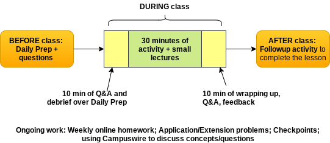

# MTH 201: Calculus 

## START HERE 

Welcome to MTH 201: Calculus! I'm Robert Talbert, a professor in the Mathematics Department, and I am grateful that you are signed up for the course and am looking forward to working with you this semester. 

Before reading any further, here are some first things to know: 

1. **My highest priority this semester is your success in this course.** I am committed to helping you be successful in MTH 201 this semester. "Success" in the course is more than just good grades. It means that you are being **challenged** to grow as a learner, that you are **engaging actively** with tasks that feed your growth, and that you are creating **excellent work** in mathematics by completing challenging Calculus-related tasks with a appropriate level of support. It also means that you are **building your lifelong learning skills** so that once the course is over, you are better and stronger as a learner and can continue to **learn new things independently**, and especially go on to **success in courses that have MTH 201 as a prerequisite**. 
2. **College level mathematics is more than just computation.** On the pathway to "success" as outlined above, you will be asked to do more than just perform computations. You will be working on **explaining the meaning** of mathematical processes and results in oral and written forms to different audiences; **working on realistic applications** of basic skills to authentic problems; **extending basic ideas** to more advanced concepts; and **seeking true understanding** of underlying concepts. In fact, many of the computations you might do with algebra in high school level mathematics will be automated through computers in MTH 201, and your work will mostly focus on these higher-level tasks. 
3. **You can expect to be challenged intellectually throughout this course.** None of these elements of "success" come easily. They require dedicated devotion of time and energy to wrestling with the concepts and tasks in the course. This will require you to leave your comfort zones on a regular basis. You may find that you need to rewire your entire process for learning things. You will need to stay constantly engaged with the course through participation in class meetings and on the class discussion board --- asking questions, seeking understanding, and giving help.  
4. **Intellectual struggle is normal and healthy in a challenging course.** Since none of this is easy, you can expect at times to feel like you are really struggling with the material --- even if in your earlier math courses you might never have experienced struggle. **This is a normal and healthy experience.** When you are building physical muscles, the point at which you are growing the most is the moment you experience the greatest strain and fatigue. Legitimate struggle is actually a sign you are doing things right, and it's a signal you're about to experience explosive growth. **Our class is a safe place for you to experience those struggles.** 
5. **You have a lot of help available to you as you work.** Throughout the semester, you will be challenged but also given a lot of support to help you rise to the challenge. I will be readily available to help in several channels; your classmates will be available for help through structured and informal support groups; and the GVSU Math Department provides free help through the Math Center. **Everyone in the course has your back.** 
6. **You will find MTH 201 to be very enjoyable if you embrace the challenge.** Although hard work doesn't always feel good in the moment, by embracing the challenge and committing to learning Calculus, I think you will find that **growth is fun** and **Calculus is really interesting stuff**. 

## Course information

**Instructor**: Robert Talbert, Ph.D., Professor of Mathematics. Email: talbertr@gvsu.edu. Phone: ???

**Instructor availability:** My office is **Mackinac Hall C-2-513**; however due to public health concerns, **all student meetings this semester will be conducted remotely** unless you have a specific need that requires a physical meeting outside of class. Open drop-in hours will be held *(insert times here)* through Google Meet, using the link *(insert link here)*. **You do not need an appointment for open drop-in hours; just click the link to join.** (You may be put into a waiting room if there is a meeting in process.) Outside those hours, you can contact me by email or phone, through a direct message on Campuswire, or by scheduling an appointment at http://rtalbert.youcanbook.me. 

**Limits on availability:** Please note that **I typically only check email and other messages between 6am and 6pm on weekdays and once on Saturday mornings**. If you send a message that needs a response during those times, *you can expect to get a response within 6 hours*. Otherwise you can expect one when I am back online. Please plan accordingly --- for example, do not send messages after 6pm with the expectation of an immediate response. **If you have a question and it can be made public, you'll get a much faster response if you post it to CampusWire instead**. 

**Face-to-face Meetings**: This course is being conducted in a *staggered hybrid* mode in which your section is split into two groups, called the "Red" group and the "Blue" group, and the different groups take turns meeting face-to-face (F2F) and working online. The time and location of your F2F meetings depends on your section and group: 

| Section |  Red group  | Blue group | 
|:------: | :--: | :---: | 
| 02 | Monday/Wednesday 10:00-10:50am, Mackinac Hall D-1-135 | Tuesday/Thursday 10:00-10:50am, Mackinac Hall D-1-135 
| 04 | Monday/Wednesday 3:00-3:50pm, Mackinac Hall A-1-165 | Tuesday/Thursday 3:00-3:50pm, Mackinac Hall A-1-165

**Textbook:** We will use *Active Calculus* (2018 edition) by Matt Boelkins. The textbook is freely available online at https://activecalculus.org/single/frontmatter.html. There is also a PDF version available, and instructions for ordering a printed copy, at  https://activecalculus.org/. **The online version is preferred.** 

**Course website and discussion board:** All course announcements, assignments, and grades will be communicated using the course **Blackboard** site available at http://mybb.gvsu.edu All other course communications (including additional examples, guidance on assignments, etc.) will be available through **Campuswire**, our class discussion tool; to join, go to https://campuswire.com/p/GAD2DF67E and join with the code ``7913``. 

**Course calendar:** A Google Calendar for the course, will all due dates and other important time-sensitive information posted on it, is available on Blackboard through a link in the left sidebar. **Be sure to check the calendar once daily** for upcoming events. The calendar is kept up-to-date constantly and **in cases of apparent conflicts in times or dates, the calendar is considered to be correct always.** 

**Technology:** To use the course tools, you will need to have access to the following: 

+ **A laptop or tablet device**, preferably one with a **touchscreen that allows writing on the screen with a stylus**. Please plan on bringing this device with you to all F2F meetings. 
+ **A modern web browser**. Chrome is preferred, but browsers such as Firefox and Edge are also fine. 
+ **Reliable access to high-speed internet**. 
+ **An active GVSU network account** so that you can access email, Blackboard, and Google Docs. 

If you have any issue with accessing any of the above, please let me know as soon as possible. We will use a variety of additional course tools during the semester, but they will be free to use, and you will be taught how to use them as part of the class. 

**What Calculus is about:** Calculus is the mathematical study of **change**. Quite frequently we care not only about *how much* there is of a certain quantity but *how fast it is changing* at a given point in time. Case in point: The current Covid-19 pandemic. The number of Covid-19 cases in the USA is important, but at least as important is the rate at which that number is growing or shrinking right now. Calculus starts with simple geometry and introduces the important concept of the *limit* to develop an entire language, focused on the *derivative* and the *definite integral*, that allows us to describe and calculate change. 

**Course content:** We will cover chapters 1-4 of the *Active Calculus* text. Key topics to be studied include: understanding functions from the perspective of calculus, the concept of limit, the definition and meaning of the derivative, computing derivatives, using derivatives in applications, antiderivatives and definite integrals and their meaning, and the Fundamental Theorem of Calculus. In every topic, we seek a **conceptual understanding** from several perspectives, the ability to **apply ideas**, development of **logical reasoning and communication skills**, and an **appreciation for calculus as a whole**.

**Official course description:** A development of the fundamental concepts of calculus using graphical, numerical, and analytical methods with algebraic and trigonometric functions of a single variable. Limits and continuity, derivatives, indefinite integrals, definite integrals, and the Fundamental Theorem of Calculus; applications of derivatives and integrals. Fulfills Foundations - Mathematical Sciences. Offered every semester. *Prerequisites*: MTH 122 and MTH 123; or MTH 124; or assignment through Grand Valley math placement.

## Learning Objectives 

By the end of the course, you will be able to:

- Use **functions** and other pre-Calculus mathematics proficiently.
- Calculate, use, and explain the concept of **limits**.
- Explain and interpret the meaning of the **derivative** of a function.
- Use **shortcuts** to calculate derivatives efficiently.
- Use derivatives to solve authentic real-life **application problems**.
- Use **definite integrals and the Fundamental Theorem of Calculus** to find areas and total change.

A full list of official departmental objectives for MTH 201 can be found [here](https://www.gvsu.edu/cms4/asset/9A420BCF-BA9E-0845-91754145EA82C51F/sor_descriptions_objectives__topics_for_faculty_updated_12-11-19.pdf). 

Your progress toward these course objectives will be tracked using **Learning Targets**. There are 24 individual Learning Targets covering all the major skills in the course; a complete list of these is in Appendix ??? at the end of this syllabus. Your grade in the course will be based in large part on the amount and quality of evidence you can provide, through various forms of work, that you've mastered these Learning Targets. 

## Structure and flow of the course 

Your MTH 201 course is being offered in a **staggered hybrid** mode. "Staggered" means that while we will have F2F meetings regularly, we will stagger the attendance so that only about half the section is in attendance at any give meeting, for social distancing purposes. "Hybrid" means that the course is a combination of F2F work and asynchronous online work, with about a 50/50 split in our case. The content of MTH 201 is divided into 12 **modules**, each of which is subdivided into a "Part A" and a "Part B". A complete list of modules and the content they cover is in the Appendix  at the end of this syllabus. 

Your work in the class will follow a simple, repeating pattern that will involve you **before**, **during**, and **after** our meetings. It works like this: 

+ **BEFORE each class**: You'll complete a **Daily Prep** assignment in which you'll get familiar with the **basic concepts** of the upcoming lesson through guided reading, video, or hands-on activity and completion of basic exercises on new concepts. Daily Prep assignments will typically be due by 11:59pm ET the night before the lesson; you'll be able to work ahead if you want. 
+ **DURING each clas**s: Class meetings will typically start with 10 minutes for going over the Daily Prep assignments and fielding your questions. Then we will spend most of the class (around 30 minutes) doing activities together on the harder concepts from the material. There may be some small lectures, but active work will be the main event since you can only learn math by doing it! Then we will typically spend 10 minutes wrapping up, going through some of the main points of the activity, taking short ungraded quizzes to give you feedback on your learning, and then getting your feedback on the lesson. 
+ **AFTER each class**: In the hybrid format, only about half the lesson is covered during the in-class session. The rest of the lesson is learned through **Followup Activities** that you will do asynchronously (outside of class on your own schedule). Followup activities are basically what we **would* do as active group work if we were going to meet for a second hour on the lesson. 

This pattern repeats for each F2F meeting that you have with your group. 

Finally, there is ongoing work that you'll be doing outside the flow of class meetings: Online homework done weekly to practice the ideas from the module, Application/Extension Problems that take your basic skills to the next level and into real-world applications, and Checkpoints given roughly every other week that assess your mastery of basic skills. More on these in the "Learning Activities in MTH 201" section below. 

Visually, the workflow looks like this: 

**Live streaming of F2F meetings:** All F2F meetings will be live-streamed over either Zoom or Google Meet. If you cannot attend one of your designated F2F meetings, you will have the option of participating remotely through the live stream. 

## Learning activities in MTH 201 

You will be engaging with several different kinds of activities in the course, both to learn the material and to demonstrate how well you have learned it. Our course uses a **mastery grading** system in which **most graded items do not use points**, but rather your work will be required to meet certain levels of quality that demonstrate *mastery*. We will discuss this several times in class, and there is more information later in this document.  

The kinds of activities you will undertake are: 

+ **Daily Preparation (DP)**: You will complete Daily Prep assignments before each of your F2F meetings. Each Daily Prep assignment involves reading, video-watching, or playing with an interactive tool and then answering questions and working exercises on basic learning obejctives. Each Daily Prep is graded with a "check" if it is submitted by the deadline (given on the course calendar), every exercise has a response, and each response indicates a good-faith effort to be right. Otherwise the work receives an "x". 
+ **Followup Activities (FA)**: Following your face-to-face meeting, you'll complete a short set of activities roughly equivalent to an in-class group activity. Followup activities will complete the lesson for each part of a module. As with Daily Prep assignments, they are grade with a "check" if the activity is completed by the due date and each part of the activity is complete with a good-faith effort to be right. Otherwise it receives an "x".  
+ **WeBWorK (WW)**: Once a week, students will complete a 16-item online homework sets that provide opportunities to practice basic ideas from each part of a module and to review. These are deployed using the *WeBWorK* online homework system at https://webwork-math.gvsu.edu/webwork2/. These will typically be due Sunday nights at 11:59pm ET. WeBWork allows for unlimited multiple attempts without penalty up to those deadlines. Each WeBWorK item is worth 1 point (some allow partial credit) ad is auto-graded by the computer on the basis of correctness of the answer. 
+ **Learning Target Checkpoints**: On a roughly bi-weekly basis, you'll receive a take-home exam called a "Checkpoint" that consists of several problems, each one of which focuses on a single Learning Target from the list in the Appendix. Each Checkpoint will contain one problem for every Learning Target that has been covered up to that point. For example, the first Checkpoint may contain problems for Learning Targets F.1 through L.2; the second Checkpoint will contain new versions of F.1 through L.2 along with first-time problems for D.1 through D.3; the third Checkpoint will contain new versions of F.1 through D.3 with first-time problems for D.4 through DC.1; and so on. **You will only need to attempt problems for Learning Targets that you have not yet mastered**. The cumulative structure allows you to attempt problems multiple times in different weeks. Students will be provided with a detailed rubric for what constitutes acceptable work on each Checkpoint problem. Work that meets the criteria for acceptable work will be given a "check"; work that does not meet the criteria will receive an "X". **Work receiving an "X" can be redone at any later Checkpoint**. See the Revision policy for details. You can also earn a "check" through means other than Checkpoints; see "How work is graded in MTH 201" below for details. 
+ **Application/Extension Problems (AEPs)**: AEPs are more extensive problems that require applying or extending the basic course knowledge from the Learning Targets. Most require technology, and all will require a formal writeup. There will be at least 8 AEP sets posted during the semester. They are graded using the EMRN rubric discussed in "How work is graded in MTH 201" and can be revised and resubmitted if needed. 
+ **Final Exam**: The final exam in the course will consist of two parts. The first part consists of big-picture questions on the overall ideas of the course. Your performance on this part contributes to the plus/minus grade in the course. The other part of the final exam will be a last Checkpoint of the semester and will give you the chance to meet additional learning targets that have not yet been mastered. 
+ **Miscellaneous engagement opportunities**: Various other activities in the class will give you the opportunity to get and stay engaged with the course. These include the Startup assignment in week 1, occasional discussion board activities, meeting certain incentive bonus deadlines, and other items. Designated items will carry 1 "engagement credit", and engagement credits will accumulate through the semester. In particular, every "check" on a Daily Prep and Followup activity is worth 1 engagement credit. 

Additionally, you'll be required to complete some basic review of mathematical functions in order to make sure you're prepared to start work with Calculus. This review is called the **Functions Bootcamp** and your completion of the bootcamp will come through either a special WeBWorK set or a take-home assessment. More information on this will be given in week 1. 

## How work is graded in MTH 201

### Proficiency and Mastery on Learning Targets 

There are 24 Learning Targets in the course, 10 of which are designated as **Core** targets due to their central nature in Calculus, and the other 14 of which are designated as **Supplemental**. There are two levels of achievement on any of the  Learning Targets: **Proficiency** and **Mastery**. Students get numerous opportunities to demonstrate understanding of the Learning Targets; every time this happens, the student receives a "check" on that Learning Target. 

+ To be rated as "Proficient" on a Learning Target, earn **one check** on it. 
+ To be rated as "Mastered" on a Learning Target, earn **two checks** on it. 

You can earn a check on a Learning Target in four different ways: 

1. *(The simplest way)* **Do work on a Checkpoint** that meets the criteria for acceptable quality, as described above.
2. **Schedule an oral assessment** (on videoconference) during which I will give a new version of a Checkpoint-like problem for that Learning Target, and you solve that problem "live" at an acceptable level. 
3. **Create a video** of yourself working out the solution to a Checkpoint-like problem that I will make for you, then submit the video. If you choose this option, you'll also be required to have a follow-up video meeting with me to discuss the solution and answer additional related questions to make sure you really understand the ideas. 
4. **Use work on an AEP set** and schedule a videoconference meeting with me to argue that your work on the AEP demonstrates mastery of the Learning Target, as well as answer follow-up questions. For example, you might do work on an AEP that you believe demonstrates proficiency with "computing derivatives correctly using multiple rules in combination" (Learning Target DC.3). If so, then you could schedule a meeting with me to explain why you think your work satisfied DC.3; I would listen and, if I agree, I might ask you to work out a second problem also related to DC.3 to make sure you really understand the idea. 

**Boundaries on these methods:** Please note the following restrictions on options 2-4 above: 

- *No more than one check per week can be earned through options 2-4*. 
- *Option 3 (make a video) must adhere to standards for video creation* (to be posted separately; basically the video must have clear sound and audio, and keep face, handwriting, and voice in the frame at all times). 
- *Mastery (two checks) *must* include at least one Checkpoint problem*. That is, you can't earn Mastery on a learning target through options 2-4 alone.

### The EMRN rubric

Work on Application/Extension Problems is graded not with points but with one of four designation: "E" (Excellent/Exemplary), "M" (Meets the standard), "R" (Needs revision), or "N" (Not assessible/Not enough information). The process of assigning these marks is shown below: 

Whenever your work on an AEP is graded, you will be given extensive actionable feedback on what was done well and what needs improvement. 

### How your semester grade is determined 

Your course grade is determined using the table below. In order to earn a particular letter grade, each requirement must be met in the column for that grade. Your *base grade* (the letter A,B,C, D, or F without plus or minus) is **the highest grade for which all the requirements are met**. 

Note: In the table, numerical values indicate the minimum level needed to meet the requirement; amounts above this level also meet the requirement. For AEP's, "M+" means "either M or E". Finally, "DP+LA" refers to the *sum* of your Daily Prep and Followup Activities with a "check"; there will be 24 of each, for a maximum total of 48. 

| Category | D | C | B | A | 
|:---: |:---: |:---: |:---: |:---: |
| Core Learning Targets (10) | 5 Proficient | 5 Proficient, 5 Mastered | 10 Mastered | 10 Mastered | 
| Supplemental Learning Targets (14) |  3 Proficient | 6 Proficient | 6 Proficient, 3 Mastered | 6 Proficient, 6 Mastered | 
| AEPs (8+)  | 2 M+ | 5 M+ | 2 E, 4 M+ | 4 E, 2 M+ | 
| WeBWorK (192) | 90 | 140 | 160 | 180 | 
| DP + FA (48) | 24 | 34 | 39 | 44 | 
| Engagement credits (100+) | 30 | 60 | 70 | 80 |

A grade of "F" is given if not all the requirements for a "D" are met. 

**Plus/minus grades:** Your base grade may be modified with a plus or minus, according to these guidelines: 

+ A "plus" is added to the base grade if all requirements for a base grade are satisfied, *and* the LT (both the Core and Supplemental) or AEP requirement for the next level up is also satisfied; *and* the big-picture portion of the final exam is passed. 
+ A "minus" is added to the base grade above in any of the following cases: (1)  All requirements for a base grade are satisfied *except one*, and that one is no more than two levels below the others; **or** (2) You meet the minimum requirements for a base grade (i.e. none of the requirements for higher levels are met) and you do not pass the big-picture portion of the final exam **or** (3) you meet the minimum requirements for a base grade but do not complete the Functions Bootcamp satisfactorily by Monday, September 14. In the first case, if the deficient area is more than two levels below, the penalty will be either a minus or a full letter grade, at my discretion.

## Revisions and tokens 

Since your work in the course is not graded with points (or is graded either 0 or 1), partial credit is not available except for occasional multi-part WeBWorK items. Instead, almost all work you do in the course can be revised and resubmitted to allow you to improve your work and raise your grade. 

**Checkpoint items** can be revised by reattempting the item on a later Checkpoint or through one of the other means described earlier. For example if you attempt a Checkpoint problem for Learning Target D.1 and receive an "x", you can: redo the problem on a later Checkpoint (where it will be the same essential task but with different specifics); schedule an oral exam via video meeting to attempt a different version of the problem; create a video for a different version of the problem; or use work on an AEP to argue that you've met the standards for that target. Remember, though, only one check per week can be earned through non-Checkpoint methods, and Mastery level on a target requires that at least one Checkpoint problem earn a "check". 

**AEPs** earning M, R, or N can be revised and resubmitted at any time. They will be regraded using the same standards as originally used. However, there are two important limitations on your revision and resubmission of AEP's: 

>**Two-submission-per-week rule: No more than two submissions of AEP sets may be made per week. This can be two new sets, two revisions, or one of each.** A third submission can be purchased with a token (below) but **four or more submissions in a week are not allowed under any cirumstance.** 

>**Revision of N grades rule: Students have to spend a token (below) in order to revise any AEP that was graded at "N" (Not Assessable).** 

**WeBWorK** items can be redone and resubmitted as many times as you want until the deadline, at no cost. 

However, **Daily Prep** and **Followup Activities** may not be revised at all; these are graded on the basis of completeness and effort only and are intended to be done once. 

### Tokens 

Tokens are a fake currency that are used to "purchase" exceptions to course policies and other advantageous items in the course. Every student starts with five of these. One token can be spent for any of the following at any time:

+ Attempt a second Learning Target in a given week through non-Checkpoint means  
+ Submit a third AEP (either revision or new submission) in a given week
+ Revise an AEP graded "N"
+ Extend the deadline on a Checkpoint by 12 hours (request must be submitted prior to the original deadline)
+ Extend the deadline on a WeBWorK set by 24 hours (request must be submitted prior to the original deadline)
+ Purchase 3 engagement credits 

To spend a token, please use the *Token Spending form* found on Blackboard in the left sidebar. 

With the exception of the last item, tokens may not be "stacked", for example by spending 3 tokens to get a 72-hour WeBWorK deadline extension. You can stack tokens to purchase engagement credits (e.g. spend 3 to get 9 EC's). 

Opportunities to earn more tokens may be given during the semester. 

## Academic integrity in MTH 201 

The university’s academic integrity policy is described in the GVSU Student Code, Section 3.1 which you can read online here: [http://bit.ly/gvsuacademicintegrity](http://bit.ly/gvsuacademicintegrity). __Every student has the responsibility of reading and understanding these policies, especially the consequences for engaging in academically dishonest activities.__

<!-- Additionally, the Computer Science major has additional guidelines for academic integrity here: [http://www.cis.gvsu.edu/academic-honesty/](http://www.cis.gvsu.edu/academic-honesty/).  -->

Some of the work you will do in the course involves collaboration; at other times collaboration may be allowed but not required; while at others it may not be allowed. Here are the rules for collaboration on each kind of work you do: 

+ *Daily Prep and Followup Activities*: You may collaborate with others, but your writeup must be in your own words. You may not copy someone's work and submit it as your own, nor may you copy the ideas from someone and simply change the wording. 
+ *Checkpoints* and other work done on Learning Targets: No interations at all with another person or with unauthorized sources on the internet is allowed. Any evidence of using information from another person or source will be investigated as academic dishonesty. 
+ *AEPs*: Similarly, no interations at all with another person or with unauthorized sources on the internet is allowed.
+ *WeBWorK*: You may discuss the general, broad ideas of  WeBWorK problems with others (including on Campuswire) but you may not use other people's work as your own. You may also not ask for specific details of a solution, either in person or on Campuswire. 

All suspected instances of academic dishonesty will be thoroughly investigated, and whether a student has committed academic dishonesty is my determination to make based on the evidence. If I determine academic dishonesty has been committed, a report will be filed with the Dean of Students office, and the minimum penalty will be: 

+ Daily Prep and Followup: A grade of "x" 
+ Checkpoints and other Learning Target work: A grade of "x" and required expense of two tokens to reattempt; for severe cases, you may be barred from reattempting. 
+ AEP's: A grade of "N", and you will not be allowed to revise or resubmit the AEP for the rest of the semester. 
+ WeBWorK: A "0" on the entire WeBWorK set. 

Note these are *minimum* penalties; additional penalties may be given including reduction of course grades and potential suspension from the university. 

**Please note: There is no need to commit academic dishonesty in this class since you can revise and resubmit almost anything.** If you come to believe that cheating or plagiarism is necessary given your situation: DON'T DO IT. Get some help instead and take comfort in the fact that you can just submit your best effort, get feedback, and try again later. 

## Additional course expectations and information  

Below are some additional important information about the course. Please note there is a separate section following this one, with course policies specific to the Covid-19 pandemic and how the class will be conducted. 

**Attendance:** Each F2F meeting will be live-streamed so that you can participate either F2F or remotely. It is critical that you actually attend your group's F2F meeting days --- Monday/Wednesday for Red group and Tuesday/Thursday for Blue group --- either F2F or synchronously online. **You may not attend the F2F meeting for the group other than your own** due to social distancing requirements; however you are welcome to watch the live stream of the other group's meeting if you want. 

You will be responsible for all announcements made in the F2F meetings and for all material covered in those meetings. Each meeting will begin on the hour; please be on time for your meetings. If circumstances beyond your control prevent you from attending F2F *or* participating remotely, please let me know so I can help you stay current. 

**Tech support:** Please note that **I (Prof. Talbert) am not able to provide support for technological issues**. If you encounter issues with technology, please use the appropriate source of help: 

+ *For help with Blackboard*: Email the Blackboard Help Desk at bbadmin@gvsu.edu or call (616) 331-8526. For hours of operation and more information see https://www.gvsu.edu/elearn/help/. 
+ *For help with the GVSU network, email, or printing*: Email the GVSU IT Help Desk at helpdesk@gvsu.edu; or call (616) 331-2101 or toll free (855) 435-7488. For hours of operation and more information see  https://www.gvsu.edu/it/. 
+ *For specific help with your computer*: Try the GVSU IT Help Desk (see previous bullet) or contact your equipment manufacturer or computer store. 
+ *For help with course tools such as Desmos and Campuswire*: Ask a question on the `#tech` channel on Campuswire, seek out the help documentation in the tool, or do a targeted Google search. 

**Deadlines and late work:** Deadlines for course work are clearly indicated on the Course Calendar; in cases of apparent conflict between dates, always assume that the Course Calendar is right. 

+ *For Daily Prep and Followup Activities*: No extensions to deadlines are available. Simply submit a good faith effort on all items by the deadline. 
+ *For Checkpoints and WeBWorK sets*: Deadlines may be extended 12 and 24 hours, respectively, by spending a token. No other extensions are available. 
+ *For AEPs*: There is only one deadline for AEP's, namely the last day of classes (11:59pm ET, Friday December 11). Otherwise you simply submit your work when it is ready to be graded (subject to the Two-Item-Per-Week Rule). This deadline will not be extended. 

**Math Center:** The Math Center, located on the second floor of Mackinac Hall near the Mathematics Department office, provides a workspace for students to work on mathematics course assignments and on-demand help from trained student workers. The Math Center also offers online help. Information on hours of operation and online access will be given during week 1.

**Special learning needs:** If you have special needs because of learning, physical or other disabilities, it is your responsibility to contact Disability Support Resources (DSR) at 616-331-2490 or http://www.gvsu.edu/dsr/ . DSR will help you arrange accommodations.  Then, speak with me in person about making those accommodations and ensure that they are consistent with your arrangements with DSR.

**Basic needs security:** If you have difficulty affording groceries or accessing sufficient food to eat every day, or if you lack a safe and stable place to live, I encourage you to visit [Replenish](https://www.gvsu.edu/replenish/), a food resource for GVSU students. If you are comfortable doing so, please speak with me about your circumstances so that I can advocate for you and to connect you with other campus resources. 

**Gender identity and expression:** If, for purposes of gender identity and expression, your official name (in Banner) does not match your preferred name, your name can be updated in Blackboard. Please contact the registrar's office to submit this request.  The registrar's office will contact the Blackboard administrator to make the change and will also contact your professors to inform them that your name in Banner will not match the name in Blackboard.

**Changes to this syllabus:** Changes to this syllabus may occur during the semester. In those cases, the changes will be announced in class and online, and if appropriate, students will be given a voice on how the changes will be implemented. It is your responsibility stay abreast of the information passed along in course announcements so that you will be aware of any changes that take place.

**Credits:** Portions of the language of this syllabus were adapted from the syllabi of Prof. Matt Boelkins and Prof. David Clark, both of GVSU. 

---

## MTH 201 COVID-19 Policies 

As you are well aware, we will be having class this semester while trying to navigate a global pandemic that seems to change every day. While we can't predict even the near future, the following are general guidelines and plans for how we can work productively together in the course. 

### Taking care of yourself

Above all else, **take care of your own physical and mental health** during these difficult times. Make sure you are getting sufficient rest, staying connected to friends and family, and giving yourself time and space to do things you enjoy outside of college. [This website lists several good tips](https://www.mayoclinichealthsystem.org/hometown-health/speaking-of-health/self-care-tips-during-the-covid-19-pandemic) for maintaining good self-care in our situation. 

Before coming to campus, **perform a self-evaluation each time** and **if you feel even the slightest bit of sickness or Covid-19 symptoms, stay home and participate remotely**. You should be on campus only if you feel *completely healthy*. 

Please know that **at any time this semester if you feel unable or unwilling to be present for a F2F meeting, you can opt out of the meeting and participate remotely --- no questions asked, no permission needed, no penalty incurred**. Remember that F2F meetings are live-streamed, and you can participate remotely through Campuswire and other means, so you will not fall behind if you have to participate from home. Also note that *there are no graded assessments done in class* so you will never have to make up work that was turned in during class. 

### Keeping our class meetings safe

When you are present in a F2F meeting, please observe the following: 

**Wear a mask at all times.** Face coverings, such as masks, are required to be worn in the classroom. Students who have forgotten their face coverings may get a disposable mask at a campus office. The evidence is clear that [face coverings are a crucial part of keeping coronavirus at bay](https://www.wbtv.com/2020/06/29/demonstration-aims-show-effectiveness-masks/) and [support the university’s commitment to providing all members of its community with an inclusive living and learning environment with equitable opportunities for success](https://www.gvsu.edu/inclusion/suggested-syllabus-language-for-inclusion-and-equity-132.htm). GVSU's policy on face coverings is posted on the [Lakers Together web site](https://www.gvsu.edu/lakerstogether/face-covering-policy-27.htm). Students who are not able to wear a face covering due to a medical condition should [contact Disability Support Services (DSR)](https://www.gvsu.edu/dsr/) to discuss their individual situation.

Please note, students who remove their masks during class, wear the mask incorrectly (for example, with the nose exposed), or refuse to wear mask at all will be reminded of this policy once, and then asked to leave if non-compliance continues. 

**Observe proper social distancing.** Your classroom has been specially arranged so that students are 6 feet apart from each other and from the professor at all times. This is sufficient for social distancing and close enough so that 2-3 students can turn to each other and discuss a concept. We will also leverage technology to allow for more remote communication, for example using the chat rooms in Campuswire. **Please do not encroach on the space of another person or share physical objects with another such as pens, calculators, or paper.** 

**Practice appropriate personal hygiene.** Wash your hands regularly or use hand sanitizer. If you must cough or sneeze, do so facing away from other people and use the inside of your elbow to cover your mouth, even if you have a mask on. You may wish to bring sanitizing wipes to wipe down your desk and seat before and after class. 

### Contingency plans for the semester 

We will begin the semester in "staggered hybrid" mode, but several things could happen during the semester that might alter this setup. Here are the initial plans for the most likely of those things. 

**If the entire university goes fully online:** In this case, **all F2F meetings will be replaced by synchronous online meetings**, still split into Red (MW) and Blue (TR) groupings. We will also introduce **an option to participate in the course asynchronously**, so that those with issues with sychronous online participation can still participate in activities. No other changes will be made. 

**If the professor cannot be on campus due to self-quarantine, but not because of illness:** (For example, if my kids or wife get sick or my daily self-assessment directs me to stay at home) In this case, we will follow the plan above for if the university goes fully online: **F2F meetings will be replace by synchronous online meetings, and an asynchronous option will be introduced**.  

**If the professor cannot be on campus due to having a Covid-19 infection:** In this case, **the entire course will be moved to an asynchronous online format** until I am well enough to resume teaching. A proxy/substitute may be appointed to grade and give feedback on Daily Prep and Followup Activities; all other graded work will be suspended until I am well enough to grade. 

In the latter two eventualities, you can expect a slowdown in the grading process and significant changes to the course calendar or syllabus. Please monitor your course announcements on a twice-daily basis to ensure you have correct information. 

*Please note*: These plans may be changed overridden by university-wide directives as the semester unfolds. Again, check course announcements twice daily. 

### Encouragement

Although these plans can be scary and demoralizing, I want you to know that **GVSU is doing everything in its power to keep people safe from Covid-19**. In my view, GVSU's campus is at least as safe from Covid-19 as the average large supermarket, which many of us visit on a regular basis now without much trepidation. Furthermore I believe that **if we observe reasonable precautions like the ones described here, then while the risk of Covid-19 is still present, there's no reason to be afraid.** We will still learn and grow intellectually just as in "normal" times if we stay focused and work together. 

## Appendix: Course modules and Learning Targets

### Learning Targets 

- Group F: Use functions and other pre-Calculus mathematics proficiently.
  - F.1: I can find the average rate of change of a function on an interval.
- Group L: Calculate, use, and explain the concept of limits.
  - L.1: **(CORE)** I can find the limit of a function at a point using numerical, graphical, and algebraic methods.
  - L.2: I can identify limits in indeterminate form and apply L'Hopital's Rule to evaluate them. 
- Group D: Explain and interpret the meaning of the derivative of a function.
  - D.1 **(CORE)**: I can find the derivative of a function, both at a point and as a function, using the definition of the derivative. 
  - D.2 **(CORE)**: I can use derivative notation correctly, state the units of a derivative, estimate the value of a derivative using difference quotients, and correctly interpret the meaning of a derivative in context. 
  - D.3 **(CORE)**: Given information about $f$, $f'$, or $f''$, I can correctly give information about $f$, $f'$, or $f''$ and the increasing/decreasing behavior and concavity of $f$ (and vice versa).
  - D.4: I can determine where a function is continuous or differentiable given a graph or formula of the function and explain my reasoning.
  - D.5: I can find the equation of the tangent line to a function at a point and use the tangent line to estimate values of the function.  
- Group DC: Use shortcuts to calculate derivatives efficiently.
  - DC.1 **(CORE)**: I can compute derivatives correctly for power, polynomial, and exponential functions and the sine and cosine functions, and basic combinations of these (constant multiples, sums, differences). 
  - DC.2 **(CORE)**: I can compute derivatives correctly for products, quotients, and composites of functions.  
  - DC.3: I can compute derivatives correctly using multiple rules in combination. 
  - DC.4: I can compute the derivatives correctly for logarithmic, trigonometric, and inverse trigonometric functions. 
- Group DA: Use derivatives to solve authentic real-life application problems.
  - DA.1 **(CORE)**: I can find the critical values of a function, determine where the function is increasing and decreasing, and apply the First and Second Derivative Tests to classify the critical points as local extrema.
  - DA.2: I can determine the intervals of concavity of a function and find all of its points of inflection.
  - DA.3: I can use the Extreme Value Theorem to find the absolute maximum and minimum values of a continuous function on a closed interval.
  - DA.4 **(CORE)**: I can set up and use derivatives to solve applied optimization problems.
  - DA.5: I can compute the derivative of an implicitly-defined function and find the slope of the tangent line to an implicit curve. 
  - DA.6: I can set up and use derivatives to solve related rates problems.
- Group INT: Use definite integrals and the Fundamental Theorem of Calculus to find areas and total change.
  - INT.1: I can calculate the area between curves, net change, and displacement using geometric formulas and Riemann sums.
  - INT.2: I can explain the meaning of each part of the definition of the definite integral in terms of a graph, and interpret the definite integral in terms of areas, net change, and displacement.
  - INT.3: I can evaluate a definite integral using geometric formulas and the Properties of the Definite Integral. 
  - INT.4 **(CORE)**: I can evaluate a definite integral using the Fundamental Theorem of Calculus.
  - INT.5 **(CORE)**: I can correctly antidifferentiate basic functions and identify antiderivatives. 
  - INT.6 I can find the average value of a function and the net change in a function over an interval using a definite integral.

### Modules, Textbook coverage, and Learning Target focus

The numbers at the end of each module refer to sections in Active Calculus. Please see the Course Calendar for the dates corresponding to these modules. 

## Course Modules 

| Module | Focus | Text | Learning Targets | 
| :----: | :----: | :----: | :----: |
| 1 | How do we find the speed of a moving object?  |  1.1, 1.2 | F.1, L.1 | 
| 2 | What is the derivative of a function? | 1.3, 1.4 | D.1, D.2  |
| 3 | What does a derivative tell us about a function? | 1.5, 1.6, 1.7 | D.3, D.4, D.5 |
| 4 | How do we efficiently compute derivatives of basic functions?  |  2.1, 2.2 | DC.1  |
| 5 | How do we compute derivatives of products and quotients?  | 2.3, 2.4 | DC.2 |
| 6 | How do we compute derivatives of composites and other functions? | 2.5, 2.6 | DC.2, DC.3, DC.4| 
| 7 | How are derivatives used to learn how things behave? | 3.1, 3.3 | DA.1, DA.2, DA.3 | 
| 8 | How are derivatives used to find the best way to do something? | 3.4 | DA.4 |
| 9 | How are derivatives used to find how fast something is changing? | 2.7, 3.5 | DA.5, DA.6 |
| 10 | How do we find how far a moving object has traveled? | 4.1, 4.2 | INT.1 | 
| 11 | What is the definite integral of a function? | 4.3, 4.4 | INT.2, INT.3 | 
| 12 | How are derivatives and integrals related? | 4.4 | INT.4, INT.5, INT.6 | 