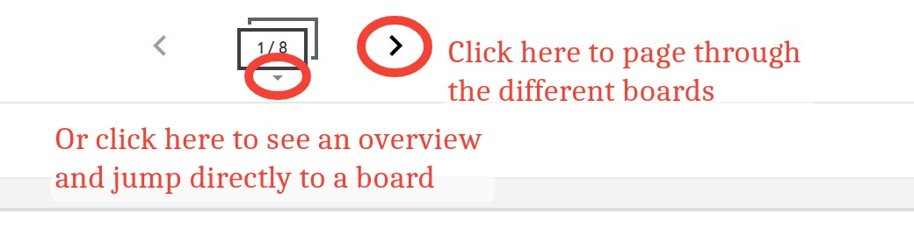

# MTH 201: Startup Assignment 

This assigment consists of seven individual tasks to complete. They cover the course itself as well as some of the most common technology tasks you need to know. You can complete them in any order you wish.  Once you have completed all seven, you will be ready to do serious work in MTH 201 because you'll be familiar with the course setup, documentation, and tech tools. 

**Grading:** Each task in this assignment will earn you **2 engagement credits** once it's completed. 

**Due dates:** Please complete all seven tasks as soon as possible, and no later than **11:59pm ET Friday September 11**. Note the following incentives and penalties: 

+ **Bonus for getting half-done early**: If you complete three of the seven tasks by **11:59pm ET on Friday September 4**, you will earn a bonus of **3 engagement credits**. 
+ **Bonus for getting all done early**: If you complete *all seven* of the tasks by **11:59pm ET on Friday September 4**, you will earn a bonus of **6 engagement credits** (for a total of 20 credits). 
+ **Penalty for non-completion**: If you do not complete all seven tasks by the September 11 deadline above, your engagement credit total will be reduced by 1 point per uncompleted item. (Example: If you complete only five of the tasks by Sept 11, you earn 10 credits but lose 2 for a total of 8.) 

## Task 1: Course Overview Quiz 

On **Blackboard**, complete the *Course Overview Quiz* with a 90% or better. You can retake the quiz as often as you need until the September 11 deadline. You are allowed to use your syllabus, the calendar, and other resources as you take it. 

## Task 2: WeBWorK Orientation

On **WeBWorK**, complete the set called "Orientation" with a 100% score. You can reattempt items in the set as often as you need until the September 11 deadline. 

## Task 3: Campuswire setup 

On **Campuswire**, do ALL of the following: 

1. **Add a clear, decent photo of yourself** as your profile picture. ([Click here to see how](https://drive.google.com/file/d/1ZHRBek3OOlqr8e8fQSekI53pqVaVrifi/view))  
2. In the Class Feed, post a Note (not a "Question") in which you introduce yourself. Click here to see how. Then write a few sentences that introduce you. Definitely give your name; you can also include info like where you are located, what your major is, an interesting fact about yourself, something you hope to learn in the course, and so on. Write at least 3-4 sentences. 
3. Then in the Class Feed, reply to at least one other person. 

## Task 4: Scanning and uploading

A common task you’ll be doing in the course is doing work by hand on paper or whiteboard, scanning it to a PDF, and submitting the work digitally on Blackboard. Click here to go to a document that contains an explanation of how to go through this process and an assignment that gives you practice with doing it: http://bit.ly/2KkIULG  To complete this task, complete the "Practice" exercise at the end of that document. 

## Task 5: Classkick

Much of the online work you do in the class is done using a tool called **Classkick**. Click here to go to an quick introduction to this tool, and complete all the activities shown. 

## Task 6: Jamboard

Another tool we will use frequently is **Google Jamboard**, a online whiteboard that you'll use to collaborate with others (and in place of the physical whiteboard in the room). Click here to go to a special Jamboard that has been set up. At the top of the page you will see this icon, which you can use to find the specific board that has your name on it: 

To complete this task, find the board with your name and do two things: Practice writing on the board (with a stylus if you have one, or with your finger or a mouse) and uploading a photo to the board. 

## Task 7: Desmos 

Finally, we will use the online graphing tool **Desmos** (http://www.desmos.com) almost every day. [Click here to go to an activity](https://docs.google.com/forms/d/e/1FAIpQLSd-yl6n24eOO8vsO15NIqT0xqEjcDTf5C8fFvhUNsMys8ZOnA/viewform) where you'll get to know some of the basic features of Desmos. If you need help or want to learn more, you can find help files and video tutorials at Desmos by clicking on the "?" icon in the upper right of the screen.  